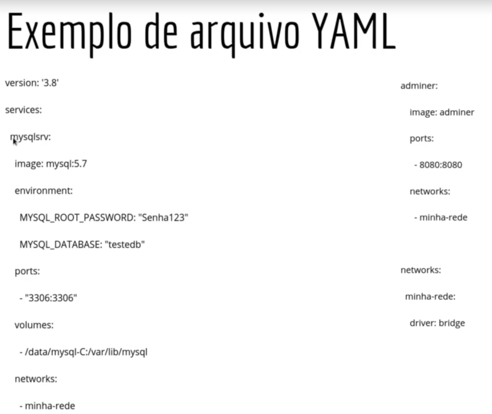
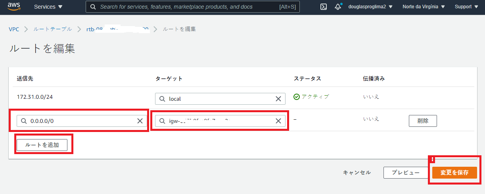
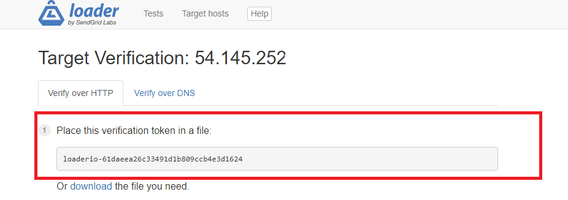
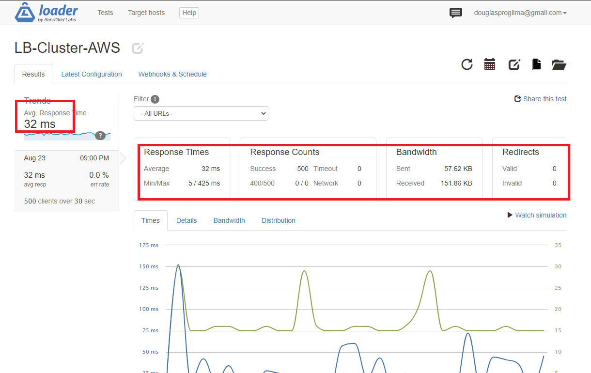

### Minhas Imagens Docker
---

<p align="center">
  
</p>

<h1 align="center">
🚀 Imagens Testes - Learning 🚀
</h1>

<p align="center">
  

  

  <a href="https://github.com/Douglasproglima/minhas-imagens-docker/commits/main">
    
  </a>

  <a href="https://github.com/Douglasproglima/minhas-imagens-docker/issues">
    
  </a>

  
</p>

### CRIANDO A PRÓPRIA IMAGEM
---
```sh
1 - Criar um container ubuntu
		docker -dti --name ubuntu-python ubuntu
	2 - Acessar o container e instalar o nano e o python
		docker exec -it ubuntu-python bash
		apt-get update
		apt-get install -y python3 nano
	3 - Criar um arquivo com extensao .py e abrir com o nano
		nano app.py
	3.1 - Dentro do nano:
		name = input("Whats your name brow? ")
		print (name)
		
	4 - Rodando o app python do lado de fora do container
		docker exec -it ubuntu-python python3 /opt/app.py
		
	/*A partir disso sei que consigo acessar do lado de fora o bash e ainda executar ferramentas que estão dentro do container*/
	Com isso posso criar o arquivo Dockerfile que me possibilita criar uma imagem e instalar ferramentas
```

#### MAO NA MASSA:
---
```sh	
#1 - Criar o diretório /minhas-imagens/app-python/
#2 - Dentro criar o arquivo app.py que irei copiar para dentro do container
$ nano app.py
#2.1 - Dentro do arquivo add
$ name = input("Whats your name brow? ")
$ print (name)
#3 - Criar o arquivo Dockerfile, esse é o arquivo responsável por criar a imagem
$ nano Dockerfile
			
  #OBS: Palavras reservadas do Dockerfile
  #*FROM -> Indica a base do container
  #*COPY -> O que será copiado para dentrodo container
  #*RUN  -> O que será executado dentro docontainer
  #*CMD  -> Comandos que serão executadoscom o bash
			
# 4 - Conteudo do Dockerfile
  #A base da imagem será a partir de uma imagem ubuntu
  FROM ubuntu
  
  # Comando a ser executado dentro da imagem | o && indica que será executado outros comandos
  RUN apt update && apt install -y python && apt clean
  
  # Copia o arquivo app.py para o diretório dentro do container
  COPY /home/douglasproglima/minhas-imagens/app-python/app.py /opt/app.py
  
  # Executa o app.py com o python3
  CMD python /opt/app.py
			
# 5 - Buildar a imagem a partir do Dockerfile
# 5.0 - Baixando a imagem:
$ docker pull python

# 5.1 - Estrutura: docker build diretorio-dockerfile -t nome-imagem
$ docker build -t ubuntu-python-dockerfile .
			
# 6 - Rodar o python a parti da imagem criada
$ docker run -it --name meu-app-py minha-img-ubuntu-py
```
#### EXEMPLO 2 - APACHE PERSONALIZADO
---
```sh
# 1 - Criar a pasta site:
$ mkdir minhas-imagens-docker/debian-apache/site
$ cd debian-apache/site
# 2 - baixar os arquivos:
$ wget http://site1368633667.hospedagemdesites.ws/site1.zip
			
#3 - Para enviar os arquivos compactados através do comando nativo do docker é necessário ter a extensão .tar
#como o arquivo baixado está como .zip, então descompacto e depois compacto com o tar novamente:
$ unzip site1.zip
$ rm -R site1.zip
$ tar -czf site.tar ./
# 4 - Copiar o site.tar para pasta anteriormente
$ cp site.tar ../
# 5 - Criar o arquivo Dockerfile e inserir o conteúdo:
  FROM debian

  RUN apt-get update && apt-get install -y apache2 && apt-get clean

  # Evita mais de uma sessão no mesmo container
  ENV APACHE_LOCK_DIR="/var/lock"
  # Contém o número de identificação do processo
  ENV APACHE_PID_FILE="/var/run/apache2.pid"
  # Usuário que irá executar o apache(www-data) - Não é aconselhavel o uso do usuário root
  ENV APACHE_RUN_USER="www-data"
  # Groupo de Usuário(www-data)
  ENV APACHE_RUN_GROUP="www-data"
  # Diretório de log
  ENV APACHE_LOG="/var/log/apache2"

  # Cópia o arquivo para o dir especificado e descompacta o arquivo
  ADD site.tar /var/www/html

  # Especifica a descrição do container
  LABEL description = "Apache Webserver 1.0"

  # Mapeamento do local dentro do container a onde os arquivos serão salvos
  VOLUME /var/www/html

  # Porta que será exposta o container
  EXPOSE 80

  # Informa qual aplicação irá rodar
  # Como será uma aplicação executada em primero plano, uso o entrypoint para informar o arquivo
  # onde terá o arquivo que será executado
  ENTRYPOINT ["/usr/sbin/apachectl"]

  # No CMD indica os parâmetros da aplicação que será executado em primeiro plano
  CMD ["-D", "FOREGROUND"]

# 6 - Gerar a imagem
# Estrutura: docker image build -t nome-image:versao ./diretorio-do-dockerfile
$ docker image build -t debian-apache:1.0 .
```
#### Imagem Debian-Apache Gerada:
____
Executando o procedimento acima, é gerado a imagem:


#### Criando o container debian-apache-container
```sh
# Subindo o container a partir da imagem criada
$ docker run -dti -p 80:80 --name debian-apache-container -m 900M --cpus 0.3 debian-apache:1.0

# Verificar o container:
$ docker ps

# Verificar o ip do container
$ docker network inspect bridge
```

#### Site no Ar


#### Container Python
---
##### Baixando a Imagem Oficial
```sh
$ docker pull python
```
##### DockerFile


#### Criando a imagem
```sh
  $ docker image build -t img-fibonacci-python:1.0 .
```


#### Gerando o container:
```sh
  $ docker run -ti --name container-fibonacci-python img-fibonacci-python:1.0
```


#### Executando a aplicação:
```sh
  $ docker exec -it container-fibonacci-python python3 ./fibonacci.py
```


### Usando Stages Diferentes
---
#### Objetivo:
  Objetivo é ter uma imagem do golang para gerar o binário executavel e outra imagem do ubuntu para executar o app gerado.

#### Baixando as Imagens:
```sh
# Imagem do Golang
$ docker pull golang

# Imagem do Alpine -> 5MB
$ docker pull alpine
```

#### Fibonacci em Golang


#### Dockerfile


#### Gerando a Imagem
```sh
$ docker image build -t img-fibonacci-go:1.0 .
```
#### Executando o binário gerado
```sh
$ docker run -it --name container-fibonacci-go img-fibonacci-go:1.0
# OU
$ docker start container-fibonacci-go
$ docker exec -it container-fibonacci-go /bin/sh -c ./fibonacci.go
```


### Subindo a Imagem para DockerHub
---
#### 1 - Criar a Conta no Dockerhub
<a href="https://hub.docker.com/" target="_blank">Dockerhub</a>

#### 2 - Logar na Conta Dockerhub
```sh
# No terminal logar na conta dockerhub
$ docker login
```

#### 3 - Gerar a Imagem
```sh
# No diretório Workspace-golang
# Estrutura: 
#docker build dir -t nome-usuario/nome-imagem:target
$ docker build . -t douglasproglima/img-fibonacci-golang:1.0
```


### Criando um Servidor de Imagens Docker
---
#### Baixar a image do registry
```sh
$ docker pull registry
```
#### Criar o Container do Registry
```sh
$ docker run -d -p 5000:5000 --restart:always --name servidor-imagens-docker registry:2
```

#### Deslogar do Dockerhub
```sh
$ docker logout
```
#### Subir Imagem para o Servidor Docker Local
Para enviar a imagem para o servidor criado, é necessário que a imagem
começe com o nome do container criado com o Registry.
Nesse caso irei copiar a imagem e renomear a image do golang
Exemplo:
```sh
# docker image tag id_image ip-servidor:porta/nome-nova-imagem
$ docker image tag 40479ebeb05e localhost:5000/img-fibonacci-golang:2.0
# OU
$ docker image tag 40479ebeb05e ip-servidor:5000/img-fibonacci-golang:2.0

# Validar a copia da imagem:
$ docker images

# Checar se há imagens no servidor docker local e
# curl ip-servidor:porta/v2/_catalog
curl localhost:5000/v2/_catalog
# OU
curl ip-servidor:5000/v2/_catalog

# Habilitar segurança na rede interna para informar para o docker o envio de imgs
$ nano /etc/docker/daemon.json

# Add o conteúdo no arquivo:
{ "insecure-registries":["192.168.1.7:5000"] }

# Após alteração reinicie o docker
$ sudo service docker restart docker

# Subir a imagem para o servidor docker local
$ docker push localhost:5000/img-fibonacci-golang:2.0
#OU
$ docker push ip-servidor:5000/img-fibonacci-golang:2.0

# Conferir se está ok:
curl localhost:5000/v2/_catalog
# OU
curl ip-servidor:5000/v2/_catalog

# Remover e Baixar a Imagem do Servidor
$ docker rmi id-image -f

# Baixar a imagem do Servidor
$ docker pull ip-servidor:5000/img-fibonacci-golang:2.0

# Criar/Executar o Container
$ docker run -it --name container-fibonacci-go 192.168.1.7:5000/img-fibonacci-golang:2.0

# Nas demais vezes basta subir o container e executar o app
$ docker start id-container OU nome-container
$ docker exec -it id-container ou nome-container /bin/sh -c ./fibonacci.go
```
## Docker Compose
---
#### Compatibilidade
---
<a href="https://docs.docker.com/compose/compose-file/compose-versioning/">Versões Docker X Versões Docker-Compose</a>

####  Instalar Docker-Compose
---
```sh
$ sudo apt-get update

$ sudo apt-get install -y docker-compose
```

#### Exemplo YAML
---


### Criando 2 Containers
---


```sh
# Subir os dois containers:
$ docker-compose up
```

### NextCloud + Redis + MariaDB
---
```sh
# Criar a pasta nextcloud-redis-mariadb
mkdir nextcloud-redis-mariadb

cd nextcloud-redis-mariadb

touch docker-compose.yaml
```
#### docker-compose.yaml
---
Observação: Não usar a imagem mais recente do mariadb, pois o nextCloud está com BUG na integração com essa imagem.
```sh
version: '3.7'
services:
  nc:
    image: nextcloud:apache
    restart: always
    ports:
      - 80:80
    volumes:
      - nc_data:/var/www/html
    networks:
      - redisnet
      - dbnet
    environment:
      - REDIS_HOST=redis
      - MYSQL_HOST=db
      - MYSQL_DATABASE=nextcloud
      - MYSQL_USER=nextcloud
      - MYSQL_PASSWORD=nextcloud
  redis:
    image: redis:alpine
    restart: always
    networks:
      - redisnet
    expose:
      - 6379
  db:
    image: mariadb:10.5.11
    command: --transaction-isolation=READ-COMMITTED --binlog-format=ROW
    restart: always
    volumes:
      - db_data:/var/lib/mysql
    networks:
      - dbnet
    environment:
      - MYSQL_DATABASE=nextcloud
      - MYSQL_USER=nextcloud
      - MYSQL_ROOT_PASSWORD=nextcloud
      - MYSQL_PASSWORD=nextcloud
    expose:
      - 3306
volumes:
  db_data:
  nc_data:
networks:
  dbnet:
  redisnet:
```
#### NextCloud


#### Checando os arquivos criados no Volume
```sh
# Navegar na maquina hospedeira
$ cd /var/lib/docker/volumes/nextcloud-redis-mariadb_db_data/
$ ls
```


#### Docker Machine
---
Com o docker machine é possível realizar o deploy do ambiente local na infra que desejar, como por exemplo: AWS, Digital OCean, Google Cloud, Azure etc...

Com posso gerenciar máquinas na nuvem através da minha máquina local.

#### Instalação
---

<a href="https://github.com/docker/machine/releases/">Avaliar as realeses no resotório oficial do github</a>

<a href="https://docs.docker.com/machine/install-machine/">Doc Oficial</a>

```sh
$ curl -L https://github.com/docker/machine/releases/download/v0.16.2/docker-machine-`uname -s`-`uname -m` >/tmp/docker-machine &&
    chmod +x /tmp/docker-machine &&
    sudo cp /tmp/docker-machine /usr/local/bin/docker-machine
```

##### Principais Comandos
---
```sh
# CREATE: Por default se não for informado nenhum parâmetro, será criado uma máquina com 1024 mb de RAM, 20GB de HD e um core de CPU
$ docker-machine create nome-maquina
# OU
$ docker-machine create --driver virtualbox --virtualbox-disk-size "50000" --virtualbox-memory "2048" nome-maquina  

# LS: Irá listar todos os hosts disponíveis em sua máquina
$ docker-machine ls

# ENV: Irá listar todas as variáveis the ambiente que precisam ser configuradas
$ eval $(docker-machine env nome-maquina)

# IP: Lista todos os IPs do nosso host Docker
$ docker-machine ip nome-maquina

# SSH: Acessar via SSH o host Docker e executar comandos Linux dentro dele
$ docker-machine ssh nome-maquina

# INSPECT: Mostra alguns detalhes do host Docker
$ docker-machine inspect first-host-box

# START/STOP: Irá iniciar/parar o host Docker 
$ docker-machine start nome-maquina
# OU
$ docker-machine stop nome-maquina

# RM: Remove o host Docker
$ docker-machine rm nome-maquina
```

#### Criar Amazon Web Service EC2 Instance
---
https://docs.docker.com/machine/examples/aws/

#### Docker Swarm Com AWS
---
Para criar máquina no EC2 pelo docker machine, existe uma série de passo.
1 - Criar o usuário com a permissão admin
Acessar https://console.aws.amazon.com/
Depois vá em IAM -> Novo Usuário

Anota os dados do novo usuário:
  usuário: nome-novo-user
  senha: nova-senha
  Politica: admin
  ID da chave de acesso: chave-de-acesso
  Chave de acesso secreta: chave-de-acesso-secreta

##### Criando a maquina no EC2
---
É necessário criar a rede na AWS para que as VM comuniquem entre si.

1 - Para isso acessar o VPC e criar uma nova rede (https://console.aws.amazon.com/vpc/home?region=us-east-1#CreateVpc:)

1.1 - Dar o nome da rede

1.2 - Definir a faixa de IP. Exemplo: Ip padrão da AWS 172.31.0.0/24


1.3 - Anotar o ID gerado, pois ao criar a VM no EC2 iremos precisar desse ID:

1.4 - Criar a subrede: https://console.aws.amazon.com/vpc/home?region=us-east-1#CreateSubnet:

Preencher os campos:
Nome
Zona de Disponilidade
IPv4 CIDR: 172.31.0.0/24


1.5 - Criar o gateway (https://console.aws.amazon.com/vpc/home?region=us-east-1#CreateInternetGateway:)

Preecher o campo Nome e depois clicar no botão salvar.

OBS: Anotar o ID do gateway pois será usado para criar a nova rota e relacionar com esse gateway criado.


1.5.1 - Atachar o gateway criado no botão superior direito.


1.6 - Criar o roteamento para que o gateway tenha acesso a rede-dw
	https://console.aws.amazon.com/vpc/home?region=us-east-1#RouteTables:
	OBS: Por padrão ao criar uma rede a mesma é relacionada ao gateway, porém é necessário realizar ajustes.




Obs: Esses são os passos essenciais, sem a rede, subrede, gateway e rota não há como criar as máquinas de forma a usar o docker swarm e gerenciar localmente

```sh
$ mkdir /home/seu-usuario-local/.aws
$ touch credentials
$ nano credentials
```

##### Corpo do arquivo:
```sh
[default]
aws_access_key_id = chave-de-acesso
aws_secret_access_key = chave-de-acesso-secreta
```

```sh
#Cria os nodes no EC2
$ docker-machine create --driver amazonec2 --amazonec2-region "us-east-1" --amazonec2-zone a --amazonec2-vpc-id "vpc-id" --amazonec2-subnet-id "subnet-id" dw1
$ docker-machine create --driver amazonec2 --amazonec2-region "us-east-1" --amazonec2-zone a --amazonec2-vpc-id "vpc-id" --amazonec2-subnet-id "subnet-id" dw1
$ docker-machine create --driver amazonec2 --amazonec2-region "us-east-1" --amazonec2-zone a --amazonec2-vpc-id "vpc-id" --amazonec2-subnet-id "subnet-id" dw1
```

Validar a VM
```sh
$ docker-machine ls
```

Acessar a VM via SSH:
```sh
$ docker-machine ssh dw1

# Alterar a senha do root da dw1
$ sudo passwd root

$ docker-machine ssh dw2

# Alterar a senha do root da dw2
$ sudo passwd root

$ docker-machine ssh dw3

# Alterar a senha do root da dw3
$ sudo passwd root
```

# Definir a VM Manager e Worker's
```sh
# logar como root na dw1
$ su
# Inicializar o swarm
$ docker swarm init

# anotar o token gerado para relacionar(join) as VM Worke's(dw2 e dw3)
$ docker swarm join --token TOKEN IP:2377

OBS: Ao final do token irá contér a IP:Porta
no próximo passo será necessário validar se essa porta está liberada no grupo
de segurança no painel da AWS.

# Acessar o aws e validar qual grupo de segurança a dw1 foi adicionada:
EC2 -> Instâncias -> Selecione a linha do VM -> Grid/Aba Inferior: Segurança -> Grupos de segurança: sg-0b4f5c4ba3c4d9d58 (docker-machine)

OBS: Geralmente as VMs criadas são adicionadas no mesmo grupo de segurança.
O importante aqui é analisar se a porta definida no passo anterior após dar o init swarm para VM Manager e validar se a porta está liberada no grupo de segurança, geramente no comando init é relacionado a porta 2377 e no painel da AWS fica liberado a porta 2376, nesse caso temos que add a porta 2377 ao grupo de segurança relacionada a VM.

Nesse caso criar uma nova regra no grupo de segunraça relacionada ao VM:

1 - EC2 -> Instâncias -> Selecione a linha do VM -> Grid/Aba Inferior: Segurança -> Grupos de segurança -> Clicar em cima do ID do grupo de segurança

2 - Button Editar regras de entrada -> Button Adicionar Regra:
  Campos: 
    TCP Personalizado: 2377
    Origem...........: 0.0.0.0/0 # Liberado para todos os IP's 
3 - Button Salvar Regra

OBS: Com o passo acima, agora posso adicionar VMs join a VM manager(dw1)

# logar como root na dw3
$ su

# Relacionar a dw2 a VM Manager dw1
$ docker swarm join --token TOKEN IP:2377

# logar como root na dw3
$ su

# Relacionar a dw3 a VM Manager dw1
$ docker swarm join --token TOKEN IP:2377

```


#### Promover as VMs dw2 e dw3  como Managers
----
```sh
$ docker node promote dw2

$ docker node promote dw3

# DEFINIR LABEL PARA VM MANAGER
$ docker node update --label-add dc=vm1 vm1
```


#### Criar Volume para Usar no Cluster
----
```sh
# No dw1 como root criar o volume app
$ docker volume create app

# Acessar a pasta onde são criados os volumes do docker:
$ cd /var/lib/docker/volumes/app/_data/

# Add o site teste ao volume app:
$ wget http://site1368633667.hospedagemdesites.ws/site1.zip

# Instalar o unzip
$ apt-get install unzip -Y

# Decompactar o site
$ unzip site1.zip
$ rm site1.zip
```

##### Replicar Imagem Apache nos 3 nodes
```sh
# Criar o serviço e montar o volume criado anteriormente

docker service create --name web-server --replicas 3 -dt -p 8080:80 --mount type=volume,src=app,dst=/usr/local/apache2/htdocs/ httpd

# Validar o serviço criado
$ docker service ls

# Liberar a porta 8080 no AWS -> Grupos de Segurança.

Mesmo procedimento feito anteriormente na etapa "# Definir a VM Manager e Worker's".

Liberar HTTP na porta 80 para todos 0.0.0.0/0

e também para o TCP Personalizado na porta 8080 para todos 0.0.0.0/0
```


Validar o ip públic da dw1:
No Painel da AWS: EC2 -> Instâncias -> Selecionar dw1 Grid/Aba Detalhes ->  Campo: Endereço IPv4 público
Acessa no browser o ip público:8080


#### Replica os arquivos do volume dw1 para as demais VMs
---
Se analisarmos o volume entre as VM dw2 e dw3 a pasta app/_data possui apenas o arquivo index.html

Diferente do volume do dw1 que possui todos os arquivos do site.html

Nesse para replicar os arquivos entre os nodes, é necessário criar um serviço NFS, onde o dw1 será o servidor e os demais nodes serão os clientes.

```sh
# instalar o serviço NFS
$ sudo apt-get install nfs-server

# Validar o status do nfs-server
$ systemctl status nfs-server

# Habilitar Sempre caso a VM for reiniciada
$ systemctl enable nfs-server

# Replicar o volume para os demais diretórios:
$ nano /etc/exports

# Dentro do arquivo add na útima linha:
/var/lib/docker/volumes/app/_data *(rw,sync,subtree_check)

Explicando as váriaveis dentro do *():
*: Liberado para qualquer endereço
(
  rw: Permissão de leitura e escrita
  sync: Sincronização
  subtree_check: Liberar as sub pastas do diretório.
)

# Exportar o diretório compartilhado anteiormente:
$ exportfs -ar

Acessar a VM dw2 e dw3 e instalar o nfs-common:
# dw2
$ apt-get install nfs-common 
```

#### Criar Nova regra de entrada AWS para o NFS
1 - EC2 -> Instâncias -> Selecione a linha do VM -> Grid/Aba Inferior: Segurança -> Grupos de segurança -> Clicar em cima do ID do grupo de segurança

2 - Button Editar regras de entrada -> Button Adicionar Regra:
  Campos: 
    NFS: 2049
    Origem...........: 0.0.0.0/0 # Liberado para todos os IP's 

3 - Button Salvar Regra

4 - Fazer a mesma coisa para "Todos os UDP"


```sh
# Acessar a dw2 e dw3
validar se tem acesso a pasta compartilhada ente a dw1 e a dw2
$ showmount -e ip-dw1

# Mapear do diretório app/_data do dw1 para o dw2 e dw3:
É importante executar o comando como root para que possa ser sobrescrito o diretório final /app/_data/:

$ mount ip-dw1:/var/lib/docker/volumes/app/_data /var/lib/docker/volumes/app/_data
```


#### Teste de Balanceamento de Carga Entre os NODES
---

Deletar o service criado anteriormente
```sh
# Deleta o service
  $ docker service rm web-server

# Delete o Volumes
  $ docker volume prune
```

Etapas:
  Criar um container de BD(MySQL) e Cluster de acesso ao BD em PHP

Objetivo:
  Testar se é possível com vários clusters acessar o BD(MySQL)

CRIA O CONTAINER MYSQL:
Acessar a VM 1 (Manager) como root e rodar o comando abaixo para criar o volume/container MySQL.

```sh
# Cria o Volume
  $ docker volume create data

  $ docker volume create data

# Cria o Container
  $ docker run -e MYSQL_ROOT_PASSWORD=Senha123 -e MYSQL_DATABASE=meubanco --name mysql-A -d -p 3306:3306 --mount type=volume,src=data,dst=/var/lib/mysql/ mysql:5.7
```

OBS: Liberar no grupo de segurança da AWS a porta 3306 do MySQL.


Criar a tabela do BD acessando o MySQL Workebeanch

``` sh
# Passar o IP público localizado no painel da AWS, o usuário e senha definido anteriormente na connectionString
# com o Workebeanch
# Depois de realizar a conexão criar tabela abaixo:

CREATE TABLE dados (
    AlunoID int,
    Nome varchar(50),
    Sobrenome varchar(50),
    Endereco varchar(150),
    Cidade varchar(50)
);
```

Próximo passo criar 3 containers usando o PHP, simulando uma API Backend que irá inserir dados no container BD.

Acessar a pasta opt e criar um novo diretório:
```sh
# Cria o Diretório meus-composes
$ cd /opt
$ mkdir meus-composes
$ cd /meus-composes

# Cria o arquivo docker-composer.yml
$ nano docker-composer.yml

# Conteúdo do arquivo docker-composer.yml:
# Esse arquivo irá gerar os containers PHP e um container phpmyadmin para acessar o container BD

version: "3.7"

services:
  # Irá criar um serviço com o nome Web
  web:
    # Indica a versão da imagem que irá ser usada para criar o container PHP
    image: webdevops/php-apache:alpine-php7
    # Acessa o serviço pela porta 80 do host: e porta 80 do container
    ports:
      - "80:80"
    # O código php está dentro da pasta /app e será replica para a pasta /app dos nodes 
    volumes:
      - app:/app

    # Tag usada para definir parâmetros no ato do deploy
    deploy:
      # Qtde de replicas que gerada desse serviço, no caso será replicado para 3 nodes(vm1, vm2 e vm3)
      replicas: 3
      # Na tag resource define os limites de hardware do container
      resources:
        limits:
          # Irá usar 20% do processador da VM
          cpus: "0.2"
          # 50 mega de memória ram que será usado
          memory: 50M

  # Irá criar um serviço do phpmyadmin
  phpmyadmin:
    image: phpmyadmin/phpmyadmin
    # Variáveis de ambiente do MySQL
    environment:
      MYSQL_ROOT_PASSWORD: "Senha123"
      PMA_HOST: "Infomar o IP público da VM 1 Manager(HOST). essa info está no painel da AWS"

    deploy:
      # Será replicado apenas uma vez, pois o BD foi definido apenas na VM1 Manager
      replicas: 1
      resources:
        limits:
          # Será usado no máximo 10% da CPU
          cpus: "0.1"
          memory: 
      # Seta o node que será atribuido o volume
      placement:
        constraints:
          - node.labels.dc == ec1
    # O banco de dados será acessado do lado de fora pela porta 8080 e acessando a porta 80 do container
	  ports:
      - "8080:80"
    # Irá criar um volume php-ini e será replicado o arquivo de configuração para dentro do volume php-ini
    volumes:
      - php-ini:/usr/local/etc/php/conf.d/php-phpmyadmin.ini

# Mapeamento dos volumes criados nos serviços listados anteriormente
volumes:
  app:
  php-ini:
```

* Para usar o docker-compose para dentro de um cluster, é usado o docker stack:
```sh
# Estrutura:
  $ docker stack deploy -c nome-arquivo nome-serviço
# Exemplo:
  $ docker stack deploy -c docker-compose.yml php-app
```


Conferir a Replica dos Serviços na AWS:
```sh
# Serviço phpmyadmin
  $ docker service ps php-app_phpmyadmin
```


```sh
# Serviço php-app
  $ docker service ps php-app_web
```

CRIAR O ARQUIVO uploads.ini no diretório 
```sh
# Conferir em qual node foi add o phpmyadmin
  $ docker service ps php-app_phpmyadmin

# acessar o node e criar o arquivo na pasta do volume
  $ cd /var/lib/docker/volumes/php_app_php-ini/_data/

  $ nano uploads.ini

# Conteúdo do arquivo
file_uploads = On
memory_limit = 500M
upload_max_filesize = 500M
post_max_size = 500M
max_execution_time = 600
max_file_uploads = 50000
max_execution_time = 5000
max_input_time = 5000
```


Replicar o volume php-app_app para os demais nodes
```sh
# Acesse a VM 1 Manager e depois export o volume a ser replicado junto com as roles
  $ nano /etc/exports

# Adiciona na última linha do arquivo *(rw,sync,subtree_check) Explicado anteriormente nesse documento:
/var/lib/docker/volumes/php-app_app/_data *(rw,sync,subtree_check)

# Exporta o volume a ser replicado
  $ exportfs -ar

# Descobrir o ip da rede interna da VM 1 local: olhar a tag 2: eth0:
 $ ip a

# Montar o volume do ip da VM1 X para os nodes VM2 e VM3
# Acessar os NODES VM2 e VM3 como ROOT e rodar o comando mount
  # Estrutura:
  mount IP da VM 1:/var/lib/docker/volumes/php-app_app/_data /var/lib/docker/volumes/php-app_app/_data

  # Exemplo:
  $ mount 172.31.0.186:/var/lib/docker/volumes/php-app_app/_data /var/lib/docker/volumes/php-app_app/_data

# Caso queria desaclopar o volume php app_app_app dos node ec2 e ec3 acessar as duas VM e rodar no terminal:
  $ umount -f /var/lib/docker/volumes/php-app_app/_data
```

Criar o app PHP para testar o balanceamento de carga
```sh
# Acessar o volume php-app_app
  $ cd /var/lib/docker/volumes/php-app_app/_data/
  
# Criar o Arquivo index.php
$ nano index.php

# Conteúdo do arquivo index.php
<html>
<head>
	<title>Exemplo PHP</title>
</head>

<?php
	ini_set("display_errors", 1);
	header('Content-Type: text/html; charset=iso-8859-1');

	echo 'Versao Atual do PHP: ' . phpversion() . '<br>';

	$servername = "IP PUBLICO VM1 AWS";
	$username = "root";
	$password = "Senha123";
	$database = "meubanco";

	/*Criar conexão*/
	$link = new mysqli($servername, $username, $password, $database);

	/*Valida a Conexão com o MySQL*/
	if (mysqli_connect_errno()) {
		printf("Falha na conexão: %s\n", mysqli_connect_error());
		exit();
	}

  /*Gera números aleatórios de 1 até 999*/
	$valor_rand1 =  rand(1, 999);
	$valor_rand2 = strtoupper(substr(bin2hex(random_bytes(4)), 1));

  /*Comando SQL para inserir os dados fakes no BD*/
	$query = "INSERT INTO dados (AlunoID, Nome, Sobrenome, Endereco, Cidade) VALUES ('$valor_rand1' , '$valor_rand2', '$valor_rand2', '$valor_rand2', '$valor_rand2')";

  /*Retorno da transação SQL*/
	if ($link->query($query) === TRUE) {
	  echo "Status Code: 201 - Novo Registro Criado com Sucesso";
  } else {
	  echo "Status Code: 401 - Erro: " . $link->error;
  }
?>
</html>
```

Validar se o arquivo index.php criado no node 1 foi replicado para os nodes 2 e 3:
```sh
# Acessar o node 2 e acessar o volume e analisar com o ls
  $ cd /var/lib/docker/volumes/php-app_app/_data
  $ ls
  
# Acessar o node 3 e acessar o volume e analisar com o ls
  $ cd /var/lib/docker/volumes/php-app_app/_data

  $ ls
```


#### Teste de Carga com o Loader.io

Caso reinicie ou desligue as VM, o ip público é alterado, sendo assim será necessário alterar os arquivos
nano export/meus-composes/docker-compose.yml
e nano /var/lib/docker/volumes/php-app_app/_data/index.php
adicionando o ip público para que o MySQL seja acessado externamente.

Start do MySQL na VM Manager:8080
```sh
$ docker ps -a

$ docker start mysql-A
```

1 - Acessar o site https://loader.io fazer o login, no menu superior "Target host", clicar no botão New Host

2 - no campo Domain, informar o IP-PUBLICO da VM Manager da AWS. Exemplo: http://1123.12.23.02

3 - Acessar a pasta onde está aplicação no diretório: cd /var/lib/docker/volumes/php-app_app/_data/

4 - Criar o arquivo com o mesmo nome sugerido no site loader.io adicionando a extensão .txt



5 - Adicionar o mesmo conteúdo sugerido no site loader.io:


6 - Salvar o arquivo, voltar ao site loader.io e clicar no botão Verify. Após isso será retornar a mensagem de Congrats.

7 - Clicar no botão New Test, preencher todos os campos conforme imagem abaixo:


OBS: Na configuração acima será adicionado 250 registros em no máximo 30 segundos no IP informado acessando app index.php.

8 - Validar o teste de carga executado. 
Acessar o ip-publico:8080 informar o usuário e senha do MySQL para acessar o phpMyAdmin, executar o comando abaixo para validar a qtde de registros existentes, pode ser feito antes e depois de executar o teste de carga:
```sh
$ Select COUNT(1) From dados
```

Após o termino do teste, será gerado alguns KPI's indicando o tempo de respostas, ocilações e outros indicadores.



Analisando o log do serviço na VM Manager para garantir que houve um stress de carga:

```sh
$ docker ps

$ docker logs id-servico
```


#### Load Balance AWS
---

> 1 - Acessar a ferramenta Load Balance, depois clicar no botão Criar Load Balancer.


> 2 - Existem 4 tipos para se criar o Load Balance:

> 2.1 - HTTP/HTTPS: Nesse tipo, caso tenha sub-redes, é possível realizar o balance por zona(São Paulo, California etc.)

> 2.3 - TCP/TLS/UDP:

> 2.4 - IP:

> 2.5 - Geração Anterior: Como tenho apenas uma única sub-rede, vou o modo clássico


> 3 - Preencher os Campos:

-> Nome do Load Balance

-> Criar LB Interno: Nome da rede criada nos passos anteriores

-> Criar um load balance interno: Caso o tráfego seja interno na AWS. No exemplo eu estou usando o tráfego externo, então deixo essa opção desmarcado.

-> Protocolo e Porta: Informar HTTP e porta 80, conforme será definido posteriormente

-> Selecione a SubRede


> 4 - Grupo de Segurança:
-> Marque o grupo de segurança criado nos procedimentos anteriores.


> Configurar Verificações de Integridade
-> Nessa etapa é definido como será testado a integridade dos nodes. No teste atual estou usando o HTTP na porta 80 e o ping path é o arquivo index.php


> Adicionar instâncias EC2: Nessa etapa basta infomar os nodes que faram parte do LB:


> Ao final é gerado o nome do DNS que uso para ser chamado externamente.
OBS: É preciso aguardar alguns minutos para que o DNS seja propagado. Em média 15 min.


##### Resumo do Fluxo
1 - USUARIO
	anotar-key-id
	anotar-access-key

1.1 - Criar a pasta .aws e arquivo credentials com o conteúdo:
	[default]
	aws_access_key_id = anotar-key-id
	aws_secret_access_key = access-key

2 - REDE VPC
	minha-rede
	vpc-123456


3 - SUB-REDE
	minha-subrede
	subnet-123456
	
4 - CRIAR GATEWAY
	meu-gateway
	igw-123456
	
4.1 - ATACHAR GATEWAY NO VPC(BOTÃO VERDE APÓS CRIAR O GATEWAY)

5 - CRIAR O ROTEAMENTO
	minha-rota
	rtb-123456
	
5.1 - Relacionar ROTEAMENTO AO GATEWAY
	5.1.1 - Button Edit Routes
	5.1.2 - Add Route
	5.1.3 - Destination: 0.0.0.0/0 Target: Id Gateway
	
6 - CRIAR AS VM NO EC2
	Estrutura do comando:
		docker-machine create --driver amazonec2 --amazonec2-region "us-east-1" --amazonec2-zone a --amazonec2-vpc-id "vpc-123456" --amazonec2-subnet-id "subnet-123456" nome-da-vm

7 - Acessar as VM's criadas e mudar a senha do root:
	docker-machine ssh nome-da-vm
	
	sudo passwd root
	su
	docker swarm init
	
8 - Definir a VM Pai e as VM's Filhas:
	docker swarm join --token TOKEN IP:2377
	
IP LOCAL: 172.31.0.21
	
9 - Acessar as VM 2 e 3 e fazer o relacionamento entre o node vm1 e as outras duas:
 docker swarm join --token SWMTKN-1-4mapkewv72f30n40whru5lz5ietbjtkvkuim3ch734wmalkkrr-a7715ovoup7cbjxgzkddsad13 172.31.0.21:2377

Feito com ❤️ por Douglas Lima </h2> [Entre em contato!](https://www.linkedin.com/in/douglasproglima)